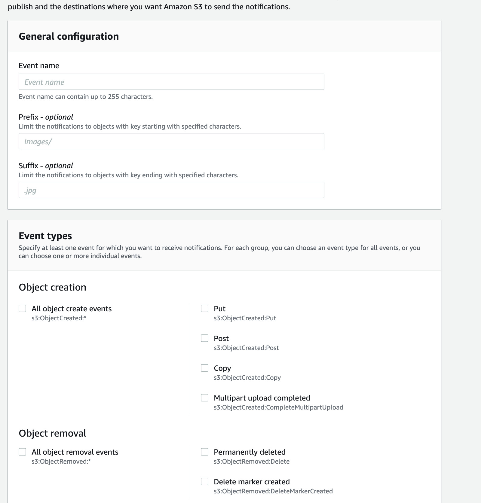
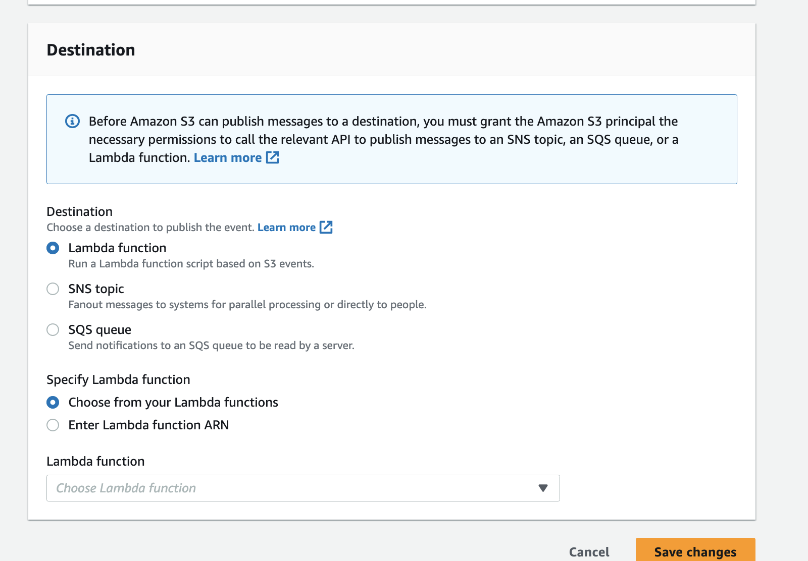
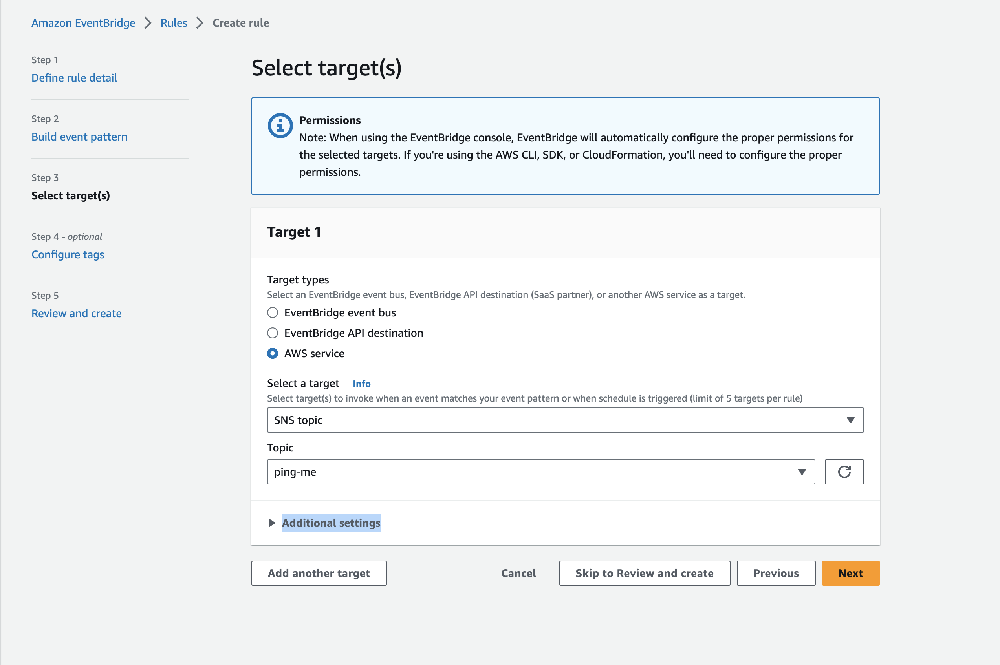
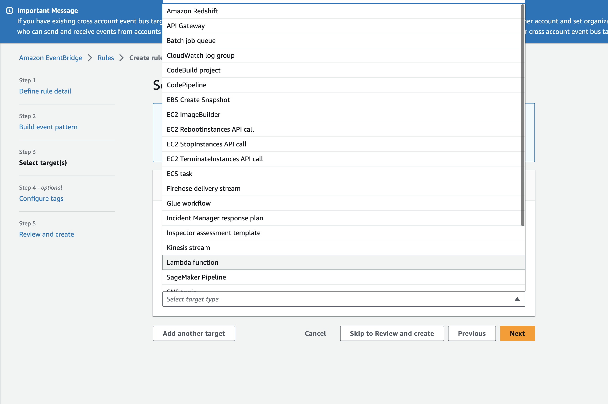
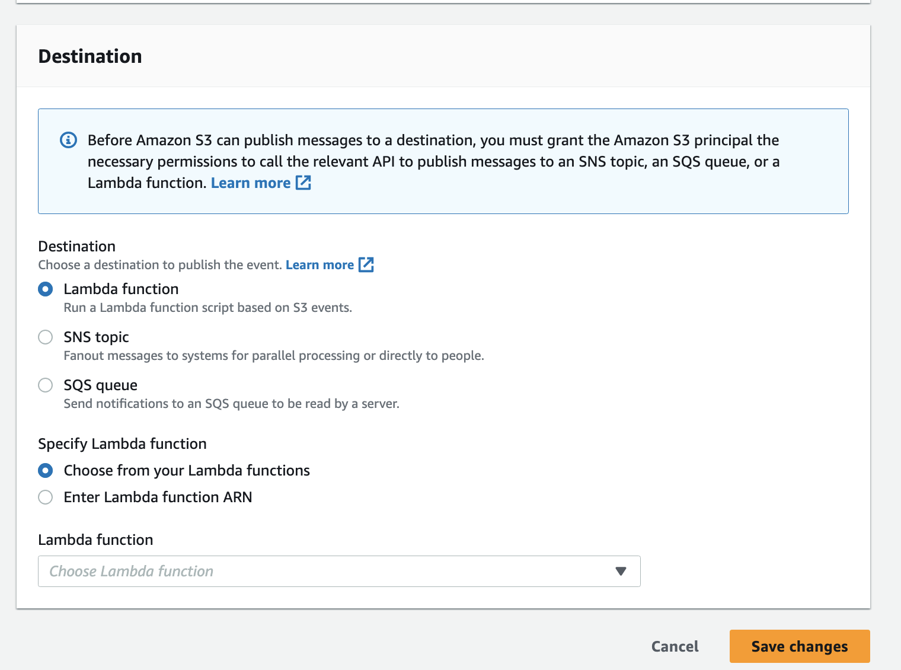

# AWS interview Questions

* how do you 
* Do I need to create NAT gateway for each Az in subnet?
  A: Each NAT gateway is created in a specific Availability Zone and implemented with redundancy in that zone. There is a quota on the number of NAT gateways that you can create in each Availability Zone. If you have resources in multiple Availability Zones and they share one NAT gateway, and if the NAT gateway’s Availability Zone is down, resources in the other Availability Zones lose internet access. To improve resiliency, create a NAT gateway in each Availability Zone, and configure your routing to ensure that resources use the NAT gateway in the same Availability Zone.
* How to send email when an object pushed to s3
  two ways,

  ### * AWS event notification

  Create an SNS topic: Go to the AWS Management Console and navigate to the Amazon SNS service. Create a new topic that will be used to publish the email notifications.

  Configure the S3 event notification: In the AWS Management Console, go to the Amazon S3 service. Select the S3 bucket for which you want to set up the event notification. Navigate to the bucket properties and find the "Events" or "Event Notifications" section.

  

  

  Add a new event notification: Add a new event notification configuration and specify the event type as "ObjectCreated" or "s3:ObjectCreated:*". This event will trigger the notification whenever a new object is created in the bucket.

  Specify the SNS topic as the destination: Configure the event notification to send the event details to the SNS topic created in step 1. This will publish the event message to the SNS topic.

  Configure the SNS topic subscription: In the SNS topic settings, subscribe an email address to the topic. This email address will receive the notifications.

  Verify the email subscription: Confirm the subscription by clicking the confirmation link sent to the subscribed email address. This step is necessary to start receiving notifications.

  Test the setup: Upload an object to the configured S3 bucket. You should receive an email notification for the object creation event.


### AWS Event Bridge:

3. Create an Amazon EventBridge rule: Go to the AWS Management Console and navigate to the Amazon EventBridge service (previously CloudWatch Events). Create a new rule that will match events from your S3 bucket.
4. Specify the event pattern: Configure the event pattern to include the bucket name. You can use the following event pattern as a starting point:

```json
{
  "source": ["aws.s3"],
  "detail-type": ["AWS API Call via CloudTrail"],
  "detail": {
    "eventSource": ["s3.amazonaws.com"],
    "eventName": ["PutObject"],
    "requestParameters": {
      "bucketName": ["YOUR_BUCKET_NAME"]
    }
  }
}

```

Replace `"YOUR_BUCKET_NAME"` with the actual name of your S3 bucket.

then setup target



AWS Event Bridge has large destination list


but from AWS S3 Event notification you have only 3 destinations


