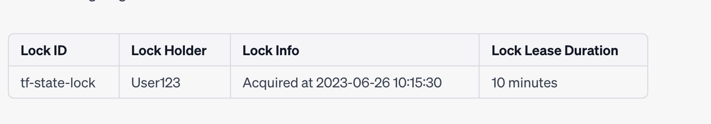

# Terraform interview Questions

1. What is Idempotency in Terraform?
   A: Idempotency is  **a property of some operations such that no matter how many times you execute them, you achieve the same result** . So in the Terraform, we will receive the same result regardless of the execution count, that's why the Terraform is said to be idempotent.
2. What is the default workspace name in terraform?
   A: it's default
3. what are output variables in Terraform for?
   A: output variables expose information for other Terraform configurations to use. Output values are similar to return values in programming languages.
4. explain how state & locking works in Terraform ?
   A:
   Terraform State: We use Terraform to create, update or destroy our resources in the cloud (AWS). But how did Terraform know which resources it had been alleged to manage? The answer is “terraform. tfstate”. Think “Terraform. tfstate” file as a database        to Terraform, where Terraform keeps a map of its config to real-world resources.

   With **Terraform remote state** everyone can be aware of the changes made in the infrastructure through Terraform.
   Terraform remote state and locking mechanisms  will solve corrupted state, data loss, or conflicts.
   Terraform Remote State can be stored with Cloud Providers like AWS, GCP, or Terraform Cloud.
   **Terraform State Locking** will make sure that the state is “locked” if it’s presently in use by another user.
   Terraform locking will be implemented in AWS as follows

   ```json
   terraform {
       backend “s3” {
           bucket = “s3-terraform-bucket-remote-state”
           key = “s3-terraform-bucket-remote-state/tfstate/terraform.tfstate”
           region = “us-east-1”
           dynamodb_table = “terraform-state-lock-dynamodb-table”
       }
   }
   ```

you need a dnamodb table with below field

```
resource “aws_dynamodb_table” “example-dynamodb” {
name = “terraform-state-lock-dynamodb-table”
hash_key = “LockID”
read_capacity = 10
write_capacity = 10
attribute {
name = “LockID”
type = “S”
}
```

```
resource “aws_dynamodb_table” “example-dynamodb” {
    name = “terraform-state-lock-dynamodb-table”
    hash_key = “LockID”
    read_capacity = 10
    write_capacity = 10
    attribute {
        name = “LockID”
        type = “S”
    }
}
```

an example lock in dynamoDB table




* Lock ID: "tf-state-lock" is a unique identifier for the lock.
* Lock Holder: "User123" represents the user or process that currently holds the lock.
* Lock Info: "Acquired at 2023-06-26 10:15:30" provides information about when the lock was acquired.
* Lock Lease Duration: The lock is valid for 10 minutes. If the lock holder fails to renew the lock within this duration, the lock will expire.

how the lock expiration process works:

1. Lock Acquisition: When a user or process wants to modify the Terraform state, it attempts to acquire the lock by updating the lock item in DynamoDB with its own information, including the lock holder and lease duration.
2. Lock Renewal: While holding the lock, the lock holder periodically sends a renewal request to DynamoDB to extend the lease duration. This renewal request is typically performed before the lease duration expires.
3. Lock Expiration: If the lock holder fails to send a renewal request within the lease duration, the lock is considered expired. At this point, other users or processes can attempt to acquire the lock and make modifications to the Terraform state.
